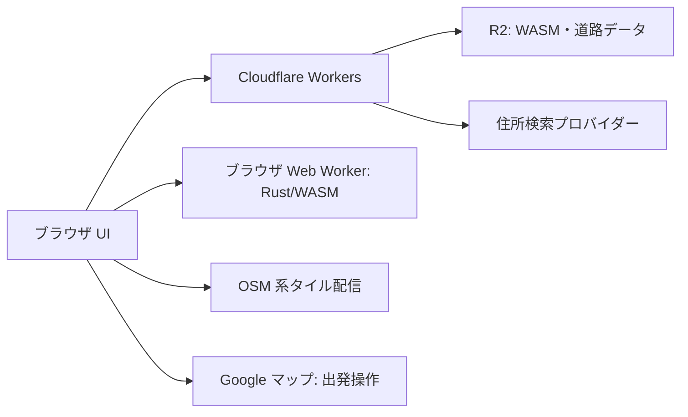
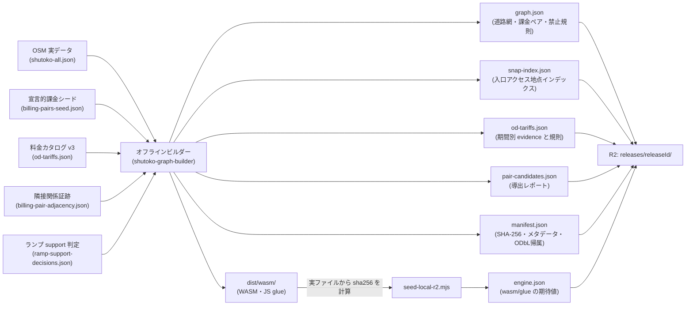

# システム設計

## 採用案と責務

Cloudflare Workers で Web アプリと API を公開し、R2 に配置した Rust/WASM と探索用道路データをブラウザに配信する。探索はブラウザの専用 Web Worker 内で行う。これは原案の配置先を維持しつつ、探索計算をサーバーのリクエスト CPU 予算から分離する提案である。低性能端末での性能とデータサイズは先行検証が必要。



| 構成 | 責務 |
| --- | --- |
| Web UI / TypeScript | 入力検証、地図と候補、選択状態、外部遷移 |
| ブラウザ Web Worker | 成果物の読込、整合性検証、WASM 呼出、結果の返却 |
| Rust 探索ライブラリ（`crates/routing-core`, `crates/routing-wasm`） | グラフ検証、周回経路探索、課金対象1区間との対応検証、時間集計、候補評価。ネットワークや DOM に依存しない |
| Cloudflare Workers | 静的配信、許可済み成果物の配信、住所検索の代理、入力制限 |
| R2 | 不変のバージョン付き WASM、グラフ、マニフェスト |
| オフラインの Rust ビルダー（`crates/graph-builder`） | OSM 実データからのトポロジ抽出、立体交差・一方通行・通行規制の反映、`firstPublicRoadConnection/v1` による端点確定、relation 制約つきの 1区間先出口検証、billing pair の自動導出レポート、料金カタログ v3 の evidence 照合、スナップインデックス生成、決定論的マニフェスト出力 |

フロントエンドのフレームワークは素の TypeScript + DOM（既存 #12 と同一）とする。地図ライブラリは **Leaflet** を採用する（軽量・成熟・モバイル負荷低・WebGL/Worker 不要で 8 秒の初回ロード予算に有利）。地図タイルは **国土地理院（GSI）標準地図タイル**（`https://cyberjapandata.gsi.go.jp/xyz/std/{z}/{x}/{y}.png`）を既定とする。GSI は無償・公共で利用規約が明確であり、OSMF Tile Usage Policy の大量アクセス制約を受けない。提供元は設定で差し替え可能にし、OSM 標準タイルは本番の無制限基盤とみなさない。経路データの帰属として「© OpenStreetMap contributors」を地図上に常時表示する。地図描画とルート探索は別の責務とし、地図タイルを探索グラフの代わりに使わない。

### オフラインデータパイプライン（`shutoko-graph-builder`）

`crates/graph-builder`（バイナリ: `shutoko-graph-builder`）は、実道路網から探索成果物をビルドする決定論的パイプラインである。



1. **トポロジ抽出と立体交差**:
   OSM の `motorway`（首都高本線）と `motorway_link`（ランプ）のみをノード・エッジに分解する。**一般道（`trunk`, `primary`, `secondary` 等）はルーティンググラフのエッジには含めない**。ルーティングモデルが「直線距離が近い入口から乗る」前提に切り替わり、一般道経路探索が不要になったためである。ただし、入口/出口ランプの分類コンテキストとして `motorway_link` の端点ノードに接する一般道 way を取得・参照している（詳細は `docs/data-pipeline.md` の「入口/出口ランプの分類方式」参照）。OSM では道路ウェイが明示的に共有ノード ID を持たない限り幾何学的に交差していてもトポロジ上は接続されない。立体交差する道路（高架・地下）は共有ノードを持たないため、ビルダーはノード ID の厳格な共有判定によって立体交差の分離を担保する。`routing-core` のスキーマをコンパクトかつ厳格に保つため、`layer` や `bridge`/`tunnel` 等の属性はグラフ成果物には保持しない。
2. **通行規制の反映**:
   OSM リレーションの `type=restriction`（右左折禁止・Uターン禁止等）を解析し、連続して通過できないエッジ列（`forbiddenTransitions`）としてグラフに埋め込む。`*:conditional` / `oneway:conditional` / `reversible` / `alternating` は静的な時間モデルでは一意に評価できないためスキップし、標準エラー出力とマニフェストへ記録する。ランプ端点の一般道接続判定では同系統の条件付きタグを **fail-closed（unresolved）** として扱い、時間帯モデルが導入されるまで条件付きアクセスを常時の公道接続として採用しない。
3. **端点の確定（`firstPublicRoadConnection/v1`）**:
   ランプ鎖を進行方向へたどり、最初に合法な一般車用 public surface way へ接続した node を端点とする（way が複数ある場合は競合として扱わず `groundWayIds[]` に記録し、互換の単数 `groundWayId` はその先頭 way ID とする）。アクセスタグ階層（`motorcar` → `motor_vehicle` → `vehicle` → `access`）、`highway` 種別の許可リスト、`service=alley` 以外の service sub-tag 拒否、`oneway` と進行方向の適合、接続の終端条件を順に評価し、公道接続が 0 本、または最初の接続 node より後に別の合法公道接続があるときは fail-closed とする。`hgv:conditional` は passenger-car の通行条件ではないため製品向けの例外として無視する。
4. **課金ペアと経路の厳格検証**:
   人手検証済みのシード定義（`data/billing-pairs-seed.json`）を読み込み、入口ランプから本線基準点、本線基準点から出口ランプへの連結性、本線の一周経路の存在、接続路内部に隠れた周回（hidden loop）が存在しないことをビルド時に自動検証する。First Exit は relation の所属と方向を尊重した **corridor 制約つき**で判定し、全体グラフでの最短出口を「1区間先」にしない。
5. **課金ペアの自動導出レポート**:
   同じビルダーが `data/billing-pair-adjacency.json`（reviewed 済みの公式路線順の隣接関係と directed route-plan 証跡）を入力に、gate 8 個（official adjacency / route / direction / first exit / mandatory lap / entry binding / exit binding / tariff assignment）をすべて通過した候補を列挙し、`pair-candidates.json` に出力する。seed ファイルは自動変更せず（`automaticSeedWrite: false`）、レビューを経て人手で更新する。OSM 幾何が公式意味を修復・昇格させることはない。
6. **料金カタログ v3 の期間別 evidence**:
   `data/od-tariffs.json` は `tariffRules`（2 期間）、期間ごとの `distanceEvidence`（版・ページ・行・列・セル・観測基本料金・SHA-256）、10 件の一意 OD `assignments`、および deprecate した 2 件を分離して保持する。金額は OSM 実走距離から作らず、規則検算と PDF セルが一致した記録だけを `priced` とする。
7. **スナップインデックス**:
   ユーザーが指定した出発座標から最寄りの入口アクセス地点（Entry エッジの from ノード）を効率的に検索するため、空間インデックス（`snap-index.json`、`schemaVersion: 2`）を構築する。現行データは 168 ノード。
8. **完全決定論的成果物ビルド**:
   エッジ・ノード・ペアのソート順序を固定し、同一入力から SHA-256 チェックサムがバイト完全一致する成果物を生成する。各成果物のサイズとハッシュは `manifest.json` に記録され、クライアント側 Web Worker による改ざん・破損検出を可能にする。WASM 本体と JS glue は Rust ツールチェーンでビルドされ環境をまたいでバイト一致しないため、`manifest.json` には載せず、投入時に実ファイルから計算した `engine.json` を配信して同じ照合を行う（`workers/scripts/seed-local-r2.mjs`）。

## WASM の実行場所を明確にする理由

Cloudflare Workers の通常の WASM 利用は事前コンパイル済みモジュールを前提とする。R2 から取得したバイナリをそのまま Workers で動的コンパイルする設計にはしない。[Cloudflare WebAssembly ドキュメント](https://developers.cloudflare.com/workers/runtime-apis/webassembly/)

ブラウザ実行案では、Rust をブラウザ向け WASM にビルドし、必要な JS glue と合わせて R2 に置く。ブラウザの Web Worker と Cloudflare Workers は別物である。端末性能が不足する場合の代替は、同じ Rust コアの WASM を Cloudflare Worker のデプロイに同梱し、R2 をデータと成果物の保管先とする構成。切り替えは実測後の設計変更とし、両方式を同時実装しない。

## データ取得から検索まで

1. UI がアプリに固定された release ID のマニフェストを取得する。
2. Web Worker が同じ release の WASM、glue、グラフを取得し、サイズ・ハッシュ・スキーマを検証する。
3. UI が確定済み出発地点と時間を Web Worker に渡す。GPS 座標を探索 API へ送る必要はない。
4. WASM が入口アクセス地点の選定（直線距離概算）、首都高の一周、入口の1区間先での退出を満たす候補を計算し、描画用の線と比較情報を返す。
5. UI が候補を選択し、出発操作時だけ Google マップの URL へ遷移する。

同期 WASM が動作中の場合、キャンセルは Web Worker を終了して実現する。UI は再検索時に新しい Web Worker を起動する。古い request ID の応答は無視する。

## 公開と更新（R2 成果物配信）

静的成果物（WASM, graph.json, od-tariffs.json, pair-candidates.json, ramps.json, snap-index.json, manifest.json, engine.json）は Cloudflare R2 バケット（バインディング名: `ARTIFACTS_BUCKET`、バケット名: `shutoko-artifacts`）を介して配信する。成果物は `releases/<releaseId>/<artifact>` に配置し、Workers は環境変数 `ALLOWED_RELEASES` で許可された版かつ `releases/<releaseId>/manifest.json` が R2 上に実在する版のみを公開する。公開済みファイルを上書きしない。新旧バージョンを混ぜないよう、キャッシュキーは完全なバージョン付きパスとする。マニフェストに載らないパスや成果物 allowlist 外の要求、任意 URL の代理取得は 404 で拒否する。`engine.json` は allowlist に含まれるが、未投入の版ではバケットにオブジェクトが無いので 404 のままである（manifest を上げるまで読ませないための意図的な挙動）。

### Cloudflare Workers Builds

Git 連携ビルドは Root directory `/`、Build command `bash scripts/cloudflare-build.sh`、Deploy command `cd workers && npx wrangler deploy`、Preview deploy command `cd workers && npx wrangler versions upload` で構成する。環境変数は `NODE_VERSION=22` と `SKIP_DEPENDENCY_INSTALL=1` を設定し、non-production branch builds は OFF にする。ビルドスクリプトが `workers` / `web` の lockfile 固定依存を `npm ci` で導入し、`web/dist` を生成する。deploy command が使う pinned Wrangler もこの workers の依存導入で準備される。

Workers Builds は Rust/WASM を生成せず、本番 R2 へ seed しない。R2 の更新は CI/CD と分離し、新しい versioned release ID の配下へ WASM・graph・manifest・engine の全成果物を先に投入・検証してから、Worker と Web が参照する release を切り替える。CI/CD は既存 release を上書きしない。

release ID はリリースごとに新しく発行し、公開済み ID を再利用しない。同じ ID に seed するとオブジェクトを1件ずつ上書きする非原子的な更新となり、投入中に `manifest.json`、`engine.json`、graph、WASM の新旧が一時的に混在しうる。このため、同じ ID への remote seed を自動デプロイへ組み込まず、remote seed は単一の Manager プロセスだけで実行する。`all-real-v1` / `all-real-v2` と C1 旧版は旧クライアント向けに保持し、現在の versioned release は `all-real-v4`、その直前の `all-real-v3` を rollback 先として許可リストに残す。seed は wrangler を `WRANGLER_BIN` → PATH の順で解決し（`npx` フォールバックは無い）、`wrangler --version` を `workers/package-lock.json` の固定版と照合してから実行する。

R2 は非公開バケットとし、Workers が配信用の許可パスだけ公開する。データはクライアントが取得できる公開情報として扱い、秘密を格納しない。WASM は `application/wasm`、JSON は `application/json; charset=utf-8`、JS は `text/javascript; charset=utf-8`、型定義は `text/plain; charset=utf-8` で返す。Cache-Control は `manifest.json` と `engine.json` に `public, max-age=300, stale-while-revalidate=60`、その他成果物に `public, max-age=31536000, immutable` を設定し、`ETag` および `If-None-Match`（304 Not Modified）に対応する。失敗時はアプリの参照 release を直前の正常版に戻す。キャッシュ済み旧クライアント向けに旧成果物を最低30日保持する。

### 静的 SPA と Worker の同一オリジン配信（`[assets]`）

`workers/wrangler.toml` の `[assets] directory = "../web/dist"` により、同一 Worker が静的ファイル（Vite ビルド後の `web/dist`）と Worker API（`/releases`・`/api`）を同一オリジンで配信する（full-stack 構成）。リクエストはまず assets に一致を試し、不一致（`/releases/...`、`/api/geocode` など）は従来どおり Worker の fetch ハンドラへフォールバックする。`not_found_handling = "single-page-application"` で 1 ページ構成の SPA とし、未一致パスは index.html を返す。ローカルでは `npm --prefix workers run seed:local` 後に `npx wrangler dev` を 1 台起動すれば 8787 で静的 + API が揃い、E2E もこの単一ポートで行う。開発時は Vite(5173) の `server.proxy` 中継も維持する。

### ローカル開発用シード手順
ローカル開発時（wrangler dev）は、`workers/scripts/seed-local-r2.mjs`（`npm --prefix workers run seed:local`）により、`fixtures/generated/*.json` の SHA-256 チェックサムおよびバイト長を `manifest.json` と照合した上で、Miniflare のローカル R2 エミュレータへ成果物一式（および WASM ビルド成果物）を一括投入できる。同時に `dist/wasm/` の実ファイルから wasm / JS glue の `sha256`・`byteLength` を計算し、`releases/<releaseId>/engine.json` として投入する（`--local` / `--remote` 共通）。`--remote` は新しい versioned release を本番 R2 へ事前投入する明示的な公開作業だけで使う。本番では既存 manifest がある ID を拒否し、payload と engine を全件 read-back 検証してから manifest を最後に置くため、未完了 release は公開条件を満たさない。

### 実際の本番デプロイ（2026-09-11 実施）
- R2 バケット: `shutoko-artifacts`（本番）/ `shutoko-artifacts-preview`（`wrangler.toml` の `preview_bucket_name`、`wrangler dev` 用）。いずれも `wrangler r2 bucket create` で新規作成。
- キー配置: `releases/c1-real-v1/{manifest.json, engine.json, graph.json, snap-index.json, shutoko_routing_bg.wasm, shutoko_routing.js, shutoko_routing.d.ts, index.d.ts}`（`workers/src/releases.ts` が読む `releases/<releaseId>/<artifact>` と一致。バケット名はキーに含めない）。これは当時の固定 ID であり、以後の成果物更新では新しい release ID を使う。
- Workers Builds: Root directory `/`、Build command `bash scripts/cloudflare-build.sh`、Deploy command `cd workers && npx wrangler deploy`（pinned wrangler 4.131.0 を使用）。本番 R2 の seed は build command に含めない。
- 配信 URL: `https://shutoko-sim-workers.raiden000discord.workers.dev`（workers.dev サブドメインは既に有効化済みだったため追加設定不要）。

## 運用・プライバシー・セキュリティ

住所検索には確定した住所を送るが、検索履歴を保存しない。座標・住所・出発リンクをアプリ URL、アクセスログ、例外本文、解析イベントへ含めない。タイル提供者には表示範囲、住所検索先には検索語、Google には出発操作で地点情報が伝わるため、画面から確認できる説明を用意する。

### レート制限と保護（[[ratelimits]]）
Cloudflare Workers 公式の Rate Limiting binding（`[[ratelimits]]`）を採用:
- `IP_RATE_LIMITER`: `CF-Connecting-IP` をキーとして送信元 IP ごとに毎分 10 回（limit: 10, period: 60）。超過時は 429 `RATE_LIMITED`（`Retry-After: 60`）。
- `GLOBAL_RATE_LIMITER`: 固定キー `"global"` でサービス全体で毎分 600 回（limit: 600, period: 60）。
プロバイダーの秘密鍵が必要な場合は Workers Secret（`GEOCODER_API_KEY`）で管理し、国土地理院 API ではキー不要の完全ローカル完結とする。接続先 URL はコード内定数とし SSRF を防止する。

### ログ設計
アクセスログおよびエラーログは以下の構造化 JSON のみに限定し、プライバシー保護のため検索クエリ・座標・クライアント IP は一切出力しない:
```json
{
  "event": "releases_request | geocode_request | unknown_route",
  "status": 200,
  "durationMs": 12,
  "releaseId": "c1-real-v2",
  "artifact": "manifest.json",
  "candidateCount": 5,
  "errorCode": "NOT_FOUND"
}
```

### CORS / CSP 方針
- **CORS 方針**: 本番環境ではフロントエンド静的ファイルと Workers API は同一オリジンで配信されるため、Workers 側に不要なワイルドカード CORS ヘッダは付与しない。ローカル開発時は Vite の開発サーバー（ポート 5173）から Workers（ポート 8787）へ `server.proxy`（`/api`, `/releases`）を用いて同一オリジン中継を行う。
- **CSP ヘッダ方針**: HTML を配信する Web アプリ層で付与する。方針: `default-src 'self'; script-src 'self' 'wasm-unsafe-eval'; worker-src 'self' blob:; connect-src 'self'; img-src 'self' data: https://cyberjapandata.gsi.go.jp https://*.tile.openstreetmap.org; frame-ancestors 'none'; object-src 'none'; base-uri 'self'`。WASM 実行のために `'wasm-unsafe-eval'` を許容する。住所検索は同一オリジンの Workers プロキシ `/api/geocode` 経由のため、`connect-src` に国土地理院 API を直接許可しない。

### 監視・保存期間
集計対象は成否コード、処理時間、成果物バージョン、候補数だけとする。保存期間は暫定14日、プロバイダー側の保存方針も選定時に確認する。通信失敗率、データ不整合、探索失敗率を監視し、住所検索障害時も既に確定した座標でのローカル探索は可能にする。


## 実走行経路と課金対象の分離

原案の「一周して1区間先で降りれば1区間分の料金」という前提を中核に置く。OSM グラフは実際に走る経路の生成に使い、別の検証済み入出口ペアデータで課金対象1区間を定義する。実走行距離からそのまま通行料金を計算しない。ペアの進行方向、対応車両・支払い条件、根拠と確認日を保持する。首都高を単に長く走る経路は、このペアと一周条件が成立しない限り候補にしない。

## 提示する料金の前提

提示する料金は**普通車 ETC 基本料金（割引適用前）**に固定する。車種 `ordinary`、支払方法 `etc`、料金種別 `base_toll_excluding_discounts`、除外割引は `midnight_discount` / `central_tokyo_inflow_discount` / `environmental_road_pricing_discount` / `etc2_discount` / `frequent_user_discount` の 5 種類。候補の toll はこの組合せを `fareLabel` / `vehicleClass` / `paymentMethod` / `fareBasis` / `discountsExcluded` として持ち、WASM / Web の reader が release の build contract と実行時に照合し、ずれた候補は部分データとして表示せず `RESULT_CONTRACT_MISMATCH` で止める。他車種の料金と各種割引の適用は別の設計とする。

金額は `data/od-tariffs.json`（料金表 v3、`tariffModelVersion=1`）が正本である。距離は 100m 単位の量子に丸め、税・端数処理はマイクロ円単位の整数演算で計算する。2026-09-30T15:00:00Z（JST 2026-10-01 00:00）を境に 2 つの `TariffRuleV1` を切り替え、期間ごとに別の `evidenceId`（版・ページ・行・列・セル・観測基本料金額）を保持する。金額、料金距離、端点 support、商品適格性を 1 つの `status` に混在させない。
