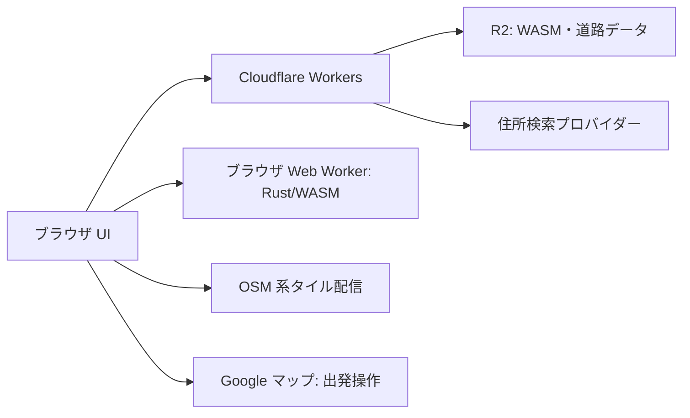

# システム設計

## 採用案と責務

Cloudflare Workers で Web アプリと API を公開し、R2 に配置した Rust/WASM と探索用道路データをブラウザに配信する。探索はブラウザの専用 Web Worker 内で行う。これは原案の配置先を維持しつつ、探索計算をサーバーのリクエスト CPU 予算から分離する提案である。低性能端末での性能とデータサイズは先行検証が必要。

| 構成 | 責務 |
| --- | --- |
| Web UI / TypeScript | 入力検証、地図と候補、選択状態、外部遷移 |
| ブラウザ Web Worker | 成果物の読込、整合性検証、WASM 呼出、結果の返却 |
| Rust 探索ライブラリ | グラフ検証、周回経路探索、課金対象1区間との対応検証、時間集計、候補評価。ネットワークや DOM に依存しない |
| Cloudflare Workers | 静的配信、許可済み成果物の配信、住所検索の代理、入力制限 |
| R2 | 不変のバージョン付き WASM、グラフ、マニフェスト |
| オフラインの Rust ビルダー | OSM からグラフ抽出、規制・接続情報と1区間先の入出口ペアの検証、成果物生成 |

フロントエンドのフレームワークと地図ライブラリは未選定。地図描画とルート探索は別の責務とし、地図タイルを探索グラフの代わりに使わない。

## WASM の実行場所を明確にする理由

Cloudflare Workers の通常の WASM 利用は事前コンパイル済みモジュールを前提とする。R2 から取得したバイナリをそのまま Workers で動的コンパイルする設計にはしない。[Cloudflare WebAssembly ドキュメント](https://developers.cloudflare.com/workers/runtime-apis/webassembly/)

ブラウザ実行案では、Rust をブラウザ向け WASM にビルドし、必要な JS glue と合わせて R2 に置く。ブラウザの Web Worker と Cloudflare Workers は別物である。端末性能が不足する場合の代替は、同じ Rust コアの WASM を Cloudflare Worker のデプロイに同梱し、R2 をデータと成果物の保管先とする構成。切り替えは実測後の設計変更とし、両方式を同時実装しない。

## データ取得から検索まで

1. UI がアプリに固定された release ID のマニフェストを取得する。
2. Web Worker が同じ release の WASM、glue、グラフを取得し、サイズ・ハッシュ・スキーマを検証する。
3. UI が確定済み出発地点と時間を Web Worker に渡す。GPS 座標を探索 API へ送る必要はない。
4. WASM が一般道接続、首都高の一周、入口の1区間先での退出を満たす候補を計算し、描画用の線と比較情報を返す。
5. UI が候補を選択し、出発操作時だけ Google マップの URL へ遷移する。

同期 WASM が動作中の場合、キャンセルは Web Worker を終了して実現する。UI は再検索時に新しい Web Worker を起動する。古い request ID の応答は無視する。

## 公開と更新

成果物を `releases/<releaseId>/` にアップロードし、統合検証後にその ID を参照するアプリを公開する。公開済みファイルを上書きしない。新旧バージョンを混ぜないよう、キャッシュキーは完全なバージョン付きパスとする。マニフェストに載らないパスや任意 URL の代理取得は拒否する。

R2 は非公開バケットとし、Workers が配信用の許可パスだけ公開する。データはクライアントが取得できる公開情報として扱い、秘密を格納しない。WASM は `application/wasm`、JSON は `application/json` で返す。失敗時はアプリの参照 release を直前の正常版に戻す。キャッシュ済み旧クライアント向けに旧成果物を最低30日保持する提案とし、期限切れは再読込を案内する。

## 運用・プライバシー

住所検索には確定した住所を送るが、検索履歴を保存しない。座標・住所・出発リンクをアプリ URL、アクセスログ、例外本文、解析イベントへ含めない。タイル提供者には表示範囲、住所検索先には検索語、Google には出発操作で地点情報が伝わるため、画面から確認できる説明を用意する。

Workers の住所検索に本文サイズ、文字数、タイムアウト、レート制限を設け、プロバイダーの秘密鍵は Workers の secret で管理する。任意の外部 URL を入力させない。CSP で script / connect / worker / img の許可先を限定し、WASM 実行に必要な設定は実装時に検証する。

集計対象は成否コード、処理時間、成果物バージョン、候補数だけとする。保存期間は暫定14日、プロバイダー側の保存方針も選定時に確認する。通信失敗率、データ不整合、探索失敗率を監視し、住所検索障害時も既に確定した座標でのローカル探索は可能にする。

## 実走行経路と課金対象の分離

原案の「一周して1区間先で降りれば1区間分の料金」という前提を中核に置く。OSM グラフは実際に走る経路の生成に使い、別の検証済み入出口ペアデータで課金対象1区間を定義する。実走行距離からそのまま通行料金を計算しない。ペアの進行方向、対応車両・支払い条件、根拠と確認日を保持する。首都高を単に長く走る経路は、このペアと一周条件が成立しない限り候補にしない。
